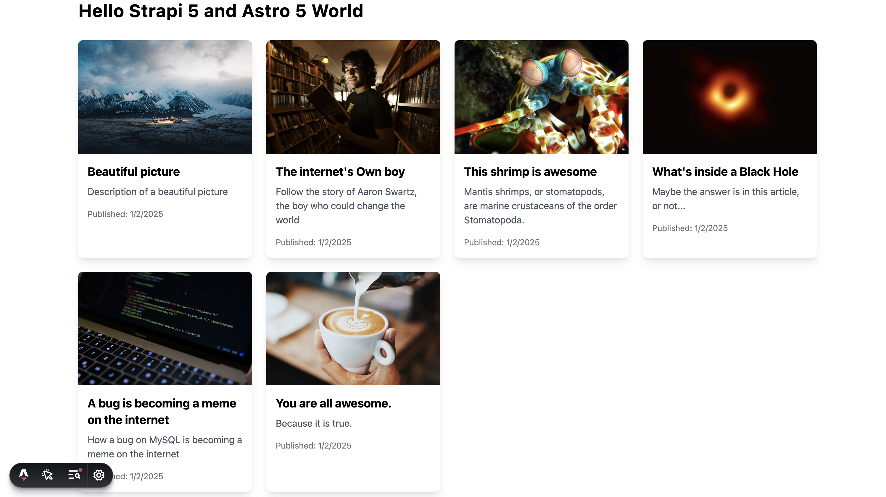

# Astro 5 and Strapi 5 Integration Example

## Integrate Astro 5 with Strapi

Astro is a modern static site builder that allows you to build a static website with a with various frameworks. Including React, Vue, Svelte, and more.

In this example, we will be using Astro 5 with Strapi 5, with Astro components.


If you haven't tried Astro 5 yet, I highly recommend it. Let's get started.

## Why Use Astro 5?

Astro.js is a powerful web framework that offers several compelling reasons to use it for your web development projects. Here are the key benefits and reasons to choose Astro:

**Performance and Speed**
Astro prioritizes performance, making it an excellent choice for building fast-loading websites:
- Zero JavaScript by Default: Astro eliminates unnecessary JavaScript, resulting in pure HTML and CSS output123. This approach significantly enhances initial page load times and improves overall site performance.
- Partial Hydration: Astro uses "islands" of interactivity, allowing you to add dynamic elements only where needed15. This keeps most of your site as static HTML while enabling interactive components when required.
  - Optimized Build Process: Astro ensures fast build times, even for large websites with thousands of pages5.

**Flexibility and Developer Experience**
Astro offers great flexibility and ease of use for developers:
- Framework Agnostic: You can use various front-end frameworks like React, Vue, Svelte, or Preact within Astro projects135. This allows you to leverage your existing skills and choose the best tools for each component.
- Component-Based Architecture: Astro's component-based approach encourages code reuse and collaboration5.
- Simple Learning Curve: The .astro UI language is a superset of HTML, making it easy for developers familiar with HTML to get started3.

**Content Focus**
Astro is particularly well-suited for content-rich websites:
Content Collections: It provides tools to organize, validate, and ensure TypeScript type-safety for Markdown content6.
- Built-in Support for Markdown and MDX: This feature is especially useful for blogs, documentation sites, and content-heavy websites5.

**SEO Benefits**
Astro's approach to generating static HTML pages can improve your site's search engine optimization:
- SEO-Friendly: Static HTML pages are easier for search engines to crawl and index, potentially leading to higher rankings and increased organic traffic3.

**Server-Side Rendering and Static Site Generation**
Astro offers flexibility in rendering strategies:
- Server-Side Rendering (SSR): Astro supports SSR, allowing for dynamic content generation4.
- Static Site Generation (SSG): It excels at creating static sites while also providing capabilities for handling dynamic data5.

By choosing Astro, you get a modern, performant, and flexible framework that prioritizes content delivery and user experience, making it an excellent choice for a wide range of web development projects.

## Astro 5 and Strapi 5 Integration

## Setup Strapi 5 Headless CMS

We are going to start by setting up our Strapi 5 project with the following command:

note: make sure that you have created a new directory for your project.

You can find the full documentation for Strapi 5 [here](https://docs.strapi.io/dev-docs/intro).

``` bash
  npx create-strapi-app@latest server
```

You will be asked to choose if you would like to use Strapi Cloud we will choose to skip for now.

``` bash
 Strapi   v5.6.0 🚀 Let's create your new project

 
We can't find any auth credentials in your Strapi config.

Create a free account on Strapi Cloud and benefit from:

- ✦ Blazing-fast ✦ deployment for your projects
- ✦ Exclusive ✦ access to resources to make your project successful
- An ✦ Awesome ✦ community and full enjoyment of Strapi's ecosystem

Start your 14-day free trial now!


? Please log in or sign up. 
  Login/Sign up 
❯ Skip 
```

After you will be asked how you would like to setup your project. We will choose the following options:

``` bash
? Do you want to use the default database (sqlite) ? Yes
? Start with an example structure & data? Yes <-- make sure you say yes 
? Start with Typescript? Yes
? Install dependencies with npm? Yes
? Initialize a git repository? Yes
```

Once everything is setup and all the dependencies are installed, you can start your Strapi server with the following command:

``` bash
  cd server
  npm run develop
```

You will be greeted with the the **Admin Create Account** screen.


Go ahead and create your first Strapi user.  All of this is local so you can use whatever you want.

Once you have created your user you will be redirected to the **Strapi Dashboard** screen.


Since we created our app with the example data, you should be able to navigate to your **Article** collection and see the data that was created for us.


Now, let's make sure that all of the data is **published**.  If not, you can select all items via the checkbox and then click the **Publish** button.


Once all your articles are published, we will expose our Strapi API for the **Articles Collection** this can be done in Settings -> Users & Permissions plugin -> Roles -> Public -> Article

You should have find and findOne selected.  If not, go ahead and select them.


Now if we make a `GET` request to `http://localhost:1337/api/articles` we should see the following data for our articles.


Nice, now that we have our Strapi 5 server setup, we can start to setup our Astro 5 client.

## Getting Started with Astro 5.

I will walk you through the steps to setup a new Astro 5 project. But here is the link to the [Astro 5 Docs](https://docs.astro.build/en/getting-started) that I used for reference.

### Astro 5 Installation and Initial Setup

Let's get started with **Astro 5**.

Make sure that you are in the `root` directory of your project and run the following command to install Astro 5.

``` bash
npm create astro@latest
```

You will be asked `Where should we create your new project?`. I will install it in the `client` directory. Once you have entered your project name, press enter.

``` bash
paul@Mac astro % npm create astro@latest

 astro   Launch sequence initiated.

   dir   Where should we create your new project?
      ./client
```

We will go with the `basic` setup.

``` bash
  tmpl   How would you like to start your new project?
         ● A basic, minimal starter (recommended)
         ○ Use blog template 
         ○ Use docs (Starlight) template 
```

Click yes for the remaining questions.

``` bash
 ██████  Project initializing...
         ■ Template copied
         ▶ Dependencies installing with npm...

      ✔  Project initialized!
         ■ Template copied
         ■ Dependencies installed

 next   Liftoff confirmed. Explore your project!

 Enter your project directory using cd ./client-temp 
 Run npm run dev to start the dev server. CTRL+C to stop.
 Add frameworks like react or tailwind using astro add.

 Stuck? Join us at https://astro.build/chat

╭──🎩─╮  Houston:
│ ◠ ◡ ◠  Good luck out there, astronaut! 🚀
╰─────╯
```

Once everything is installed, you can start your Astro 5 project with the following command:

``` bash
  cd client
  npm run dev
```

Your project should be running at `http://localhost:4321`.


Nice, now that we have our Astro 5 project setup, we can start to integrate it with our Strapi 5 server.

### Building out our Astro 5 Project 

Astro 5 uses a file based routing system. This means that you can create a new file in the `src/pages` folder and it will be automatically added to your project.

You can read more about it [here](https://docs.astro.build/en/reference/routing-reference).

But for today, we will be using the `index.astro` file in the `src/pages` folder.

Let's update the `index.astro` file with the following code:

``` astro
---
// Import necessary components and utilities
import Layout from '../layouts/Layout.astro';
import { getCollection } from 'astro:content';

// Fetch all posts from Strapi using Astro's content collection
const strapiPosts = await getCollection("strapiPostsLoader");
// Get Strapi URL from environment variables with fallback to localhost
const BASE_URL = await import.meta.env.STRAPI_URL || "http://localhost:1337";

// Helper function to handle media URLs from Strapi
function getStrapiMedia(url: string | null) {
  if (url == null) return null;
  // Return as-is if it's a data URL (base64)
  if (url.startsWith("data:")) return url;
  // Return as-is if it's an absolute URL
  if (url.startsWith("http") || url.startsWith("//")) return url;
  // Prepend BASE_URL for relative URLs
  return `${BASE_URL}${url}`;
}
---

<Layout>
  <div class="container mx-auto p-4">
  <!-- Main heading -->
	<h1 class="text-3xl font-bold mb-8">Hello Strapi 5 and Astro 5 World</h1>
	<!-- Responsive grid layout using Tailwind CSS -->
	<div class="grid grid-cols-1 md:grid-cols-2 lg:grid-cols-4 gap-6">
		{/* Map through posts and create article cards */}
		{strapiPosts.map((post) => (
			<article class="bg-white rounded-lg shadow-lg overflow-hidden">
				{/* Post cover image */}
				
				{/* Post content container */}
				<div class="p-4">
					<h2 class="text-xl font-bold mb-2">{post.data.title}</h2>
					<p class="text-gray-600 mb-4">{post.data.description}</p>
					<div class="text-sm text-gray-500">
						Published: {new Date(post.data.publishedAt).toLocaleDateString()}
					</div>
				</div>
			</article>
		))}
	</div>
</div>
</Layout>
```
Brief Description:
This is an Astro page component that displays a grid of blog posts fetched from a Strapi CMS. 

The page features:
- Integration with Strapi CMS using Astro's content collections
- A responsive grid layout using Tailwind CSS (1 column on mobile, 2 on tablet, 4 on desktop)
- Article cards with cover images, titles, descriptions, and publication dates
- A utility function (getStrapiMedia) to handle different types of media URLs from Strapi
- Proper handling of environment variables for the Strapi backend URL


### Adding Tailwind CSS to our Astro 5 Project

Notice that we are using Tailwind CSS in our project. Astro 5 uses the `@astrojs/tailwind` package.

You can read more about it [here](https://docs.astro.build/en/guides/integrations-guide/tailwind/).

Let's add it to our project by running the following command:

``` bash
  npx astro add tailwind
```

Astro will ask you a few questions, and then it will add the necessary files to your project.

``` bash
Astro will run the following command:
  If you skip this step, you can always run it yourself later

 ╭───────────────────────────────────────────────────────────╮
 │ npm install @astrojs/tailwind@^5.1.4 tailwindcss@^3.4.17  │
 ╰───────────────────────────────────────────────────────────╯

✔ Continue? … yes
✔ Installing dependencies...

  Astro will generate a minimal ./tailwind.config.mjs file.

✔ Continue? … yes

  Astro will make the following changes to your config file:

 ╭ astro.config.mjs ─────────────────────────────╮
 │ // @ts-check                                  │
 │ import { defineConfig } from 'astro/config';  │
 │                                               │
 │ import tailwind from '@astrojs/tailwind';     │
 │                                               │
 │ // https://astro.build/config                 │
 │ export default defineConfig({                 │
 │   integrations: [tailwind()]                  │
 │ });                                           │
 ╰───────────────────────────────────────────────╯

✔ Continue? … yes
  
   success  Added the following integration to your project:
  - @astrojs/tailwind
```

Nice, now that we have Tailwind CSS added to our project, can start working on the most important part of our project, which is how to fetch our data from Strapi 5 via the Astro Content Loader API.

### Fetching Data from Strapi 5 with Astro Content Loader API

In our `index.astro` file, you may have noticed that we are using the `getCollection` function to fetch our data from Strapi 5.

``` astro
const strapiPosts = await getCollection("strapiPostsLoader");
```

This is a custom function that Astro provides that allows you to fetch data via their Content Loader API.

So let's see how we can create a custom loader for our Strapi 5 data.

You can also read more about it [here](https://docs.astro.build/en/reference/content-loader-reference).


To make this work, we need to create a new file in the `src` folder called `content.config.mjs`.

This is where we will configure our custom loader.

Let's update the file with the following code:

``` astro
import { defineCollection, z } from "astro:content";
import qs from "qs";

// Define a custom content collection that loads data from Strapi
const strapiPostsLoader = defineCollection({
  // Async loader function that fetches data from Strapi API
  loader: async () => {
    // Get Strapi URL from environment variables or fallback to localhost
    const BASE_URL = import.meta.env.STRAPI_URL || "http://localhost:1337";
    const path = "/api/articles";
    const url = new URL(path, BASE_URL);

    // Build query parameters using qs to populate cover image data
    url.search = qs.stringify({
      populate: {
        cover: {
          fields: ["url", "alternativeText"],
        },
      },
    });

    // Fetch articles from Strapi
    const articlesData = await fetch(url.href);
    const { data }= await articlesData.json();

    // Transform the API response into the desired data structure
    return data.map((item) => ({
      id: item.id.toString(),
      title: item.title,
      description: item.description,
      slug: item.slug,
      createdAt: item.createdAt,
      updatedAt: item.updatedAt,
      publishedAt: item.publishedAt,
      cover: {
        id: Number(item.cover.id),
        documentId: item.cover.documentId,
        url: item.cover.url,
        alternativeText: item.cover.alternativeText,
      }
    }));
  },
  // Define the schema for type validation using Zod
  schema: z.object({
    id: z.string(),
    title: z.string(),
    description: z.string(),
    slug: z.string(),
    createdAt: z.string(),
    updatedAt: z.string(),
    publishedAt: z.string(),
    cover: z.object({
      id: z.number(),
      documentId: z.string(),
      url: z.string(),
      alternativeText: z.string(),
    }),
  }),
});

// Export the collection for use in Astro pages
export const collections = {
  strapiPostsLoader,
};
```

Brief Description:
This configuration file sets up a content collection in Astro that integrates with a Strapi CMS backend. It:
1. Fetches article data from Strapi's API including cover images
2. Transforms the API response into a consistent data structure
3. Validates the data structure using Zod schema validation
4. Makes the data available throughout the Astro application via the getCollection() function
5. The loader can be used in Astro pages to fetch and display blog posts or articles stored in Strapi, with proper typing and validation. This creates a type-safe bridge between Strapi's headless CMS and Astro's static site generation.

Before this will work, we need to install the `qs` package and it's types, since we are using it to build our query string.

``` bash
  npm i qs
  npm i @types/qs
```

Now restart your Astro 5 project and you should be able to see the data from Strapi 5 in your project.




Awesome, great job!

If you have any questions around Strapi 5 or just would like to stop by and say hi, you can join us at **Strapi's Discord Open Office Hours** Monday through Friday at 12:30pm - 1:30pm CST.

[Strapi Discord Open Office Hours](https://discord.com/invite/strapi)

For more details, visit the [Strapi documentation](https://strapi.io/documentation) and [Astro documentation](https://docs.astro.build/en/getting-started).

# astro-5-strapi-5-example
# astro-5-strapi-5-example
